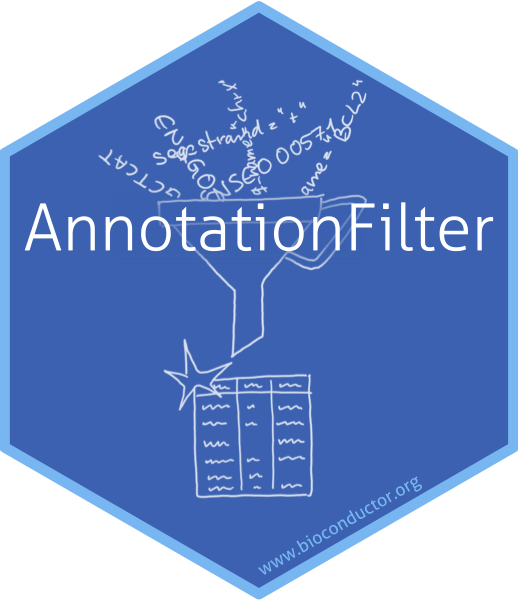

# The `AnnotationFilter` package sticker

* (hopefully) soon to be on Bioconductor; https://github.com/Bioconductor/Contributions/issues/311
* Sticker maintainer: [Johannes Rainer](https://github.com/jotsetung/)

The sticker was generated using
the [`AnnotationFilter_hexSticker.R`](./AnnotationFilter_hexSticker.R) `R`
script that uses the [`hexSticker`](https://github.com/GuangchuangYu/hexSticker)
package.

