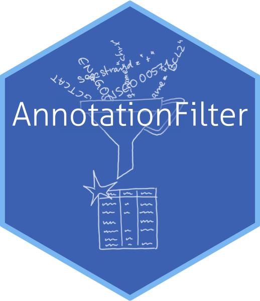
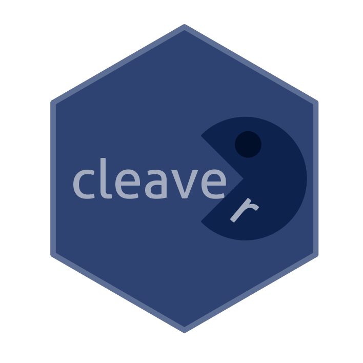
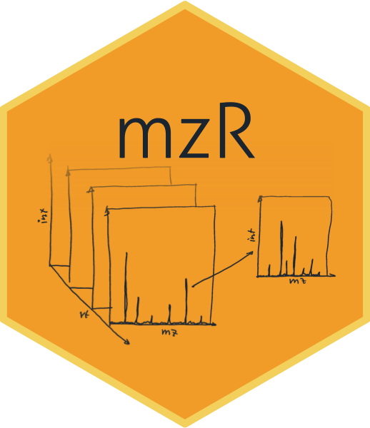
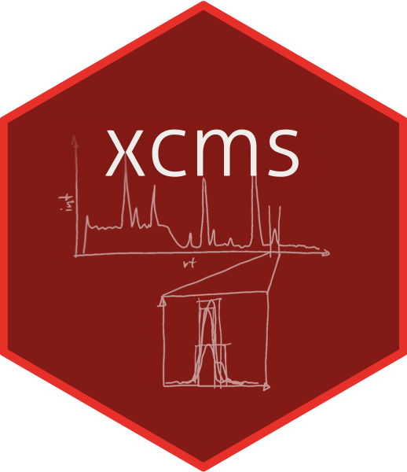

# Stickers for some Bioconductor packages

This repository contains stickers for some Bioconductor packages. Fork
this repo and create a pull request if you would like to add a sticker
for your package too. If you would like to modify existing ones,
please open an issue and discuss changes with the sticker maintainer.

## Stickers:

# Order stickers

The respectively sticker maintainers can choose to make their stickers
available. Below is a summary of where stickers can be ordered. See
individual package's `REAMDE.md` files for details and individual
package-specific links.

* `AnnotationFilter`: https://www.stickermule.com/en/marketplace/17628-annotationfilter
* `Bioconductor`: https://www.stickermule.com/user/1070825720/stickers
* `ensembldb`: https://www.stickermule.com/en/marketplace/17629-ensembldb
* `FamAgg`: https://www.stickermule.com/en/marketplace/17630-famagg
* `MSnbase`: https://www.stickermule.com/user/1070825720/stickers
* `mzR`: https://www.stickermule.com/en/marketplace/17631-mzr
* `pRoloc`: https://www.stickermule.com/user/1070825720/stickers
* `pRolocdata`: https://www.stickermule.com/user/1070825720/stickers
* `pRolocGUI`: https://www.stickermule.com/user/1070825720/stickers
* `xcms`: https://www.stickermule.com/en/marketplace/17632-xcms

# Sticker development guidelines

To start with a new sticker you might want to use the template
[template.xcf](template/template.xcf) (gimp format) or you might want
look at the
[`hexSticker`](https://github.com/GuangchuangYu/hexSticker) package to
produce the sticker entirely in `R`.

You can also find a tutorial [Sticker_instructions.png](Tutorial/Sticker_instructions.png) to design your stickers manually in `Illustrator`.

+ Each sticker should be put into a folder named according to the package.
+ Each folder should also contain a *README.md* providing at least the name of
  the package and the designer/maintainer of the sticker (which is not
  necessarily the maintainer of the package).
+ The height of the final png should be 5cm, resolution should be at least
  300dpi.
+ While it is not mandatory, it is suggested to use the *Aller* font for the
  text (available in folder *fonts/Aller*.
+ Ideally, the position of the package name text (bottom line) should be 18mm
  from the top of the image.
+ Some suggestions for color definitions:
  http://www.flatuicolorpicker.com/category/all .

# License

Except where otherwise stated, the content and the stickers in this
repository are licensed under a [Creative Commons Attribution 4.0
International license](https://creativecommons.org/licenses/by/2.0/).

You are free to:

* **Share** - copy and redistribute the material in any medium or format
* **Adapt** - remix, transform, and build upon the material

for any purpose, even commercially.

Under the following terms:

**Attribution** - You must give appropriate credit to the author of
the sticker(s, provide a link to the license, and indicate if changes
were made. You may do so in any reasonable manner, but not in any way
that suggests the licensor endorses you or your use.
