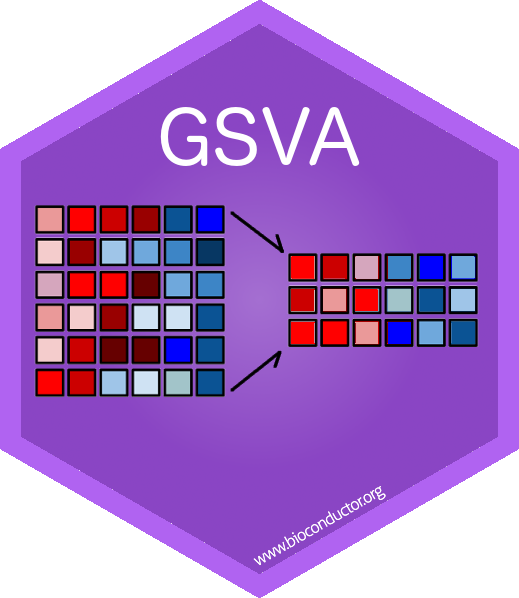
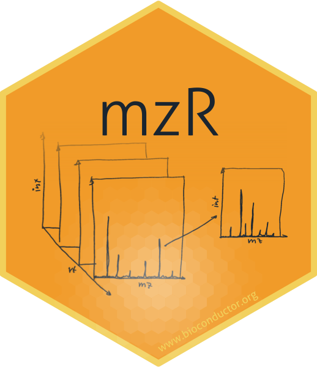
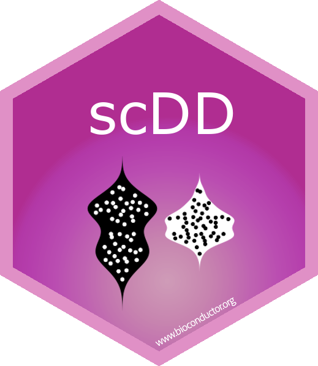
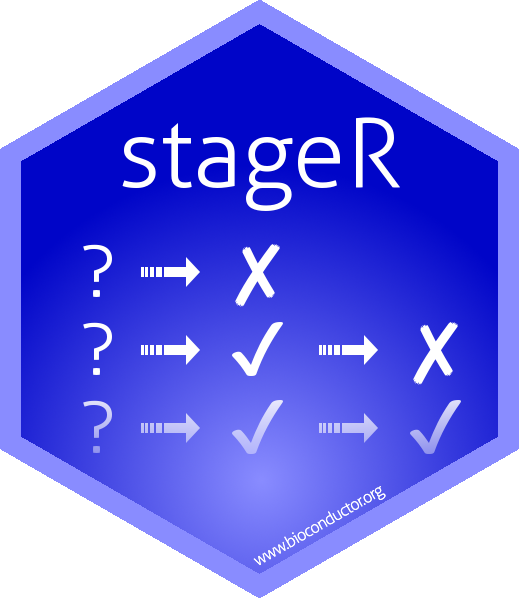
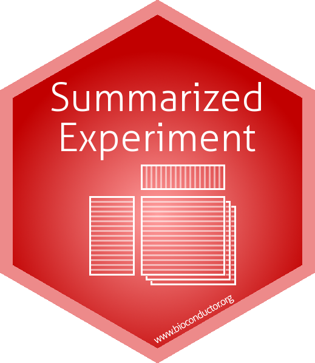
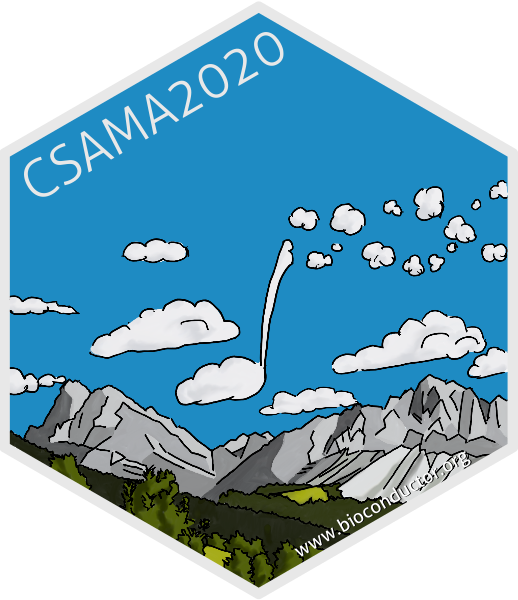

# Stickers for some Bioconductor packages

This repository contains stickers for some Bioconductor packages. Fork
this repo and create a pull request if you would like to add a sticker
for your package too. If you would like to modify existing ones,
please open an issue and discuss changes with the sticker maintainer.

## Stickers

## Stickers for *events*

Stickers for some of the Bioconductor events.

## Diversity-affirming stickers

# Sticker development guidelines

To start with a new sticker you might want to use one of the templates
([gimp_template.xcf](template/gimp_template.xcf) (gimp format) or
[inkscape_template.svg](template/inkscape_template.svg) (Inkscape format)) or
you might want to look at the
[`hexSticker`](https://github.com/GuangchuangYu/hexSticker) package to produce
the sticker entirely in `R`.

You can also find a tutorial [Sticker_instructions.png](Tutorial/Sticker_instructions.png)
to design your stickers manually in `Illustrator`.

+ Each sticker should be put into a folder named according to the package.
+ Each folder should also contain a *README.md* providing at least the name of
  the package and the designer/maintainer of the sticker (which is not
  necessarily the maintainer of the package).
+ The height of the final png should be 5cm, resolution should be at least
  300dpi.
+ While it is not mandatory, it is suggested to use the *Aller* font for the
  text (available in folder *fonts/Aller*.
+ Ideally, the position of the package name text (bottom line) should be 18mm
  from the top of the image.
+ Some suggestions for color definitions:
  http://www.flatuicolorpicker.com/category/all .

# License

Except where otherwise stated, the content and the stickers in this
repository are licensed under a CC0 1.0 Universal (CC0 1.0) Public
Domain License.

You can copy, modify, distribute and perform the work, even for
commercial purposes, all without asking permission. See more details
[here](https://creativecommons.org/publicdomain/zero/1.0/).
