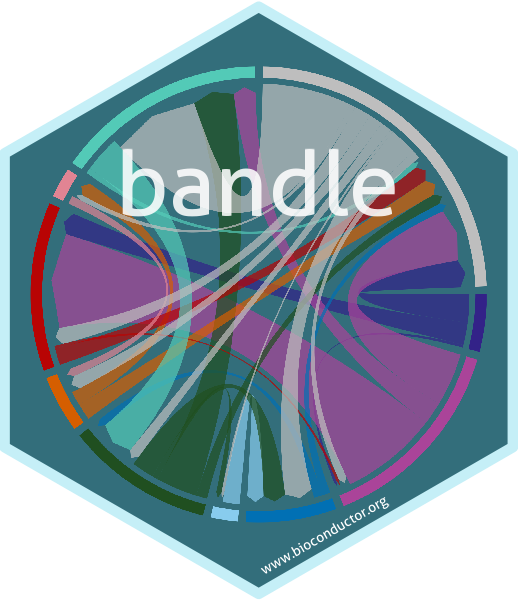

# The `bandle` package sticker

- Package URL: [bandle](https://www.bioconductor.org/packages/release/bioc/html/bandle.html).
- Design: [Lisa Breckels](https://github.com/lmsimp/) and [Oliver Crook](https://github.com/ococrook) 
based on the package stickers for the sister packages
[pRoloc](https://www.bioconductor.org/packages/release/bioc/html/pRoloc.html) et
al packages designed by [Laurent Gatto](https://github.com/lgatto/).
- Maintainer: [Lisa Breckels](https://github.com/lmsimp/).
- The code for assembling the different components into the final sticker is
based on the [`hexSticker` package](https://cran.r-project.org/web/packages/hexSticker/index.html), 
by Guangchuang Yu.
- License: Creative Commons Attribution
  [CC-BY](https://creativecommons.org/licenses/by/2.0/). Feel free to
  share and adapt, but don't forget to credit the author.

