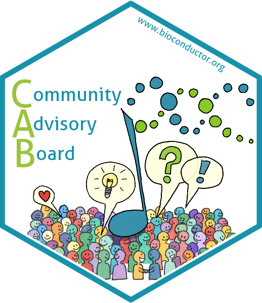

# The sticker and logo for the Bioconductor Community Advisory Board (CAB)

* This is the logo and sticker for the Bioconductor [Community Advisory
  Board](https://bioconductor.org/about/community-advisory-board/).
* Sticker designer: Johannes Rainer (@jorainer; twitter: @jo_rainer).
* Contributions and Suggestions: Leonardo Collado-Torres, Aedin Culhane, Matt
  Ritchie, Kozo Nishida.
* License for the sticker and all drawings and pictures in this folder: Creative
  Commons Attribution
  [CC-BY](https://creativecommons.org/licenses/by/2.0/). Feel free to share and
  adapt, but don't forget to credit the author.

