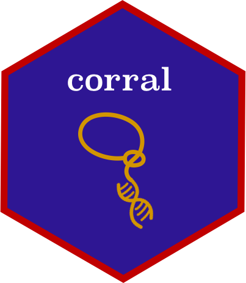

## `corral`
*Dimensionality reduction and batch integration methods for single cell data*

  

Package URL: https://www.bioconductor.org/packages/devel/bioc/html/corral.html

Maintainer: Lauren Hsu

GitHub: https://github.com/laurenhsu1/corral

License: Creative Commons Attribution CC-BY. Feel free to share and adapt, but don't forget to credit the author.
