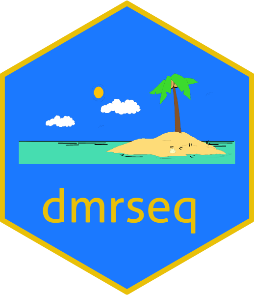

# The `dmrseq` package sticker

* Package URL: http://bioconductor.org/packages/dmrseq/
* Sticker maintainer: [Keegan Korthauer](https://github.com/kdkorthauer/)
* License: Creative Commons Attribution
[CC-BY](https://creativecommons.org/licenses/by/2.0/). Feel free to
share and adapt, but don't forget to credit the author.

The sticker was generated using
the [`dmrseq_hexsticker.R`](./dmrseq_hexsticker.R) `R` script that uses
the [`hexSticker`](https://github.com/GuangchuangYu/hexSticker) package. 

The island image is part of the clipartion project, see https://clipartion.com/ for credits.
