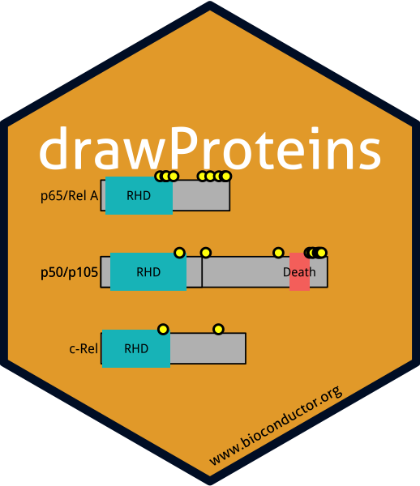

# The `drawProteins` package sticker

* Package URL: <http://bioconductor.org/packages/release/bioc/html/drawProteins.html>
  * Sticker maintainer: [Paul Brennan](https://github.com/brennanpincardiff/)

  The sticker was generated using the [`drawProteins_hexsticker.R`](./drawProteins_hexsticker.R) `R` script that uses
the [`hexSticker`](https://github.com/GuangchuangYu/hexSticker) package.

The code and sticker is also shared on the [R for Biochemists blog](http://rforbiochemists.blogspot.com/2018/06/creating-drawproteins-hex-sticker.html)
