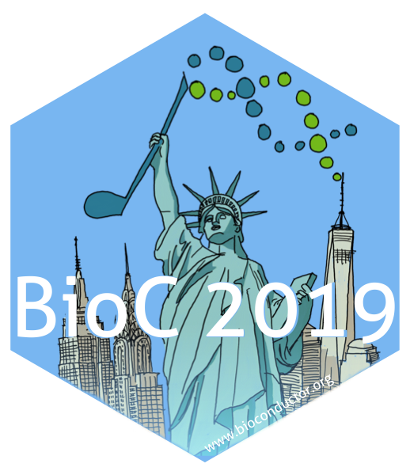
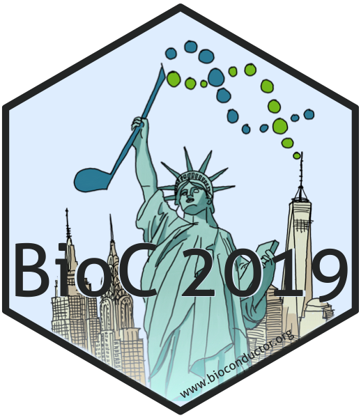

# The sticker for the BioC2019 conference in New York

* Sticker designer: Johannes Rainer (@jorainer).
* Contributions and Suggestions: Marcel Ramos (@LiNk-NY), Laurent Gatto
  (@lgatto), Martin Morgan (@mtmorgan), Levi Waldron (@lwaldron).
* License for the sticker and all drawings and pictures in this folder: Creative
  Commons Attribution
  [CC-BY](https://creativecommons.org/licenses/by/2.0/). Feel free to share and
  adapt, but don't forget to credit the author.

There are 3 variants of the sticker:

