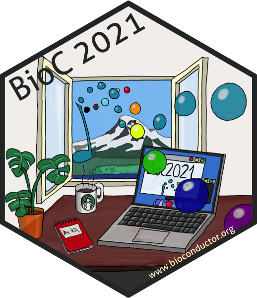
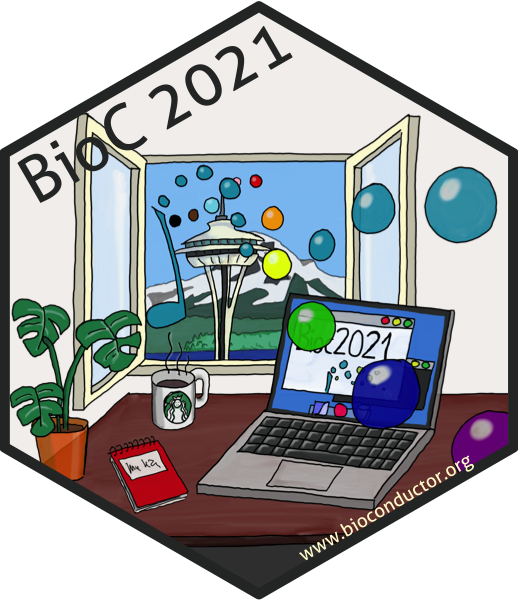
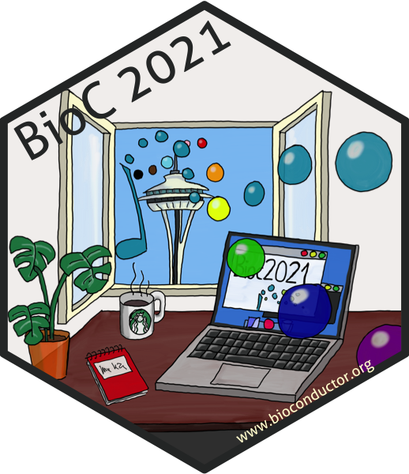

# The sticker for the BioC 2021 conference

* Sticker designer: Johannes Rainer (@jorainer).
* Contributions and Suggestions (see issue
  [#139](https://github.com/Bioconductor/BiocStickers/issues/139): Mikhail
  Dozmorov @mdozmorov, Martin Morgan @mtmorgan, Marcel Ramos @LiNk-NY, Aedin
  Culhane @aedin and Levi Waldron @lwaldron.
* The view from the window shows (depending on the version) Mt Rainier and/or
  the Seattle's Space needle.
* License for the sticker and all drawings and pictures in this folder: Creative
  Commons Attribution
  [CC-BY](https://creativecommons.org/licenses/by/2.0/). Feel free to share and
  adapt, but don't forget to credit the author.

