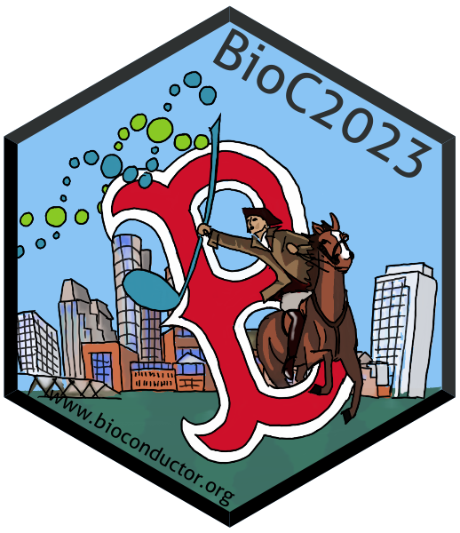
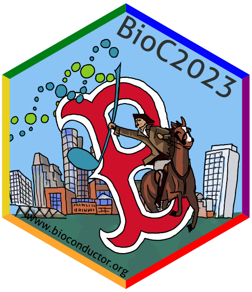
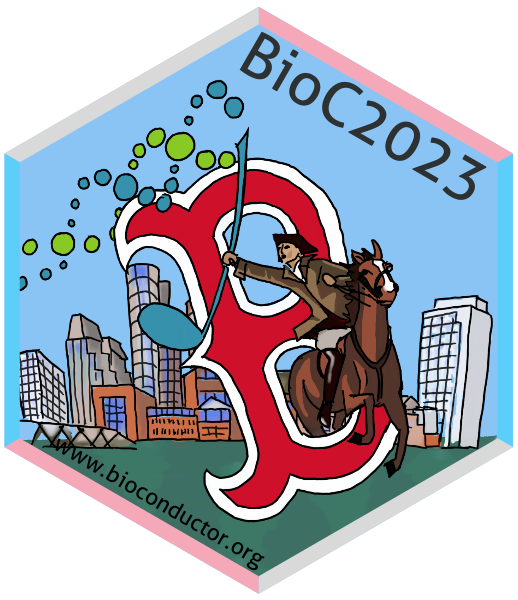

# The sticker for the BioC 2023 conference in Boston

* Sticker designer: Johannes Rainer (@jorainer).
* The sticker shows [Paul Revere](https://en.wikipedia.org/wiki/Paul_Revere)
  holding the Bioconductor logo in his hand and jumping through a *B* (for
  Boston) with the Boston skyline in the background.
* Contributions and Suggestions: Lucas Schifferl (@schifferl), Aedin Culhane
  (@aedin), Marcel Ramos (@LiNk-NY), Vince Carey (@vjcitn), Charlotte Soneson
  (csoneson) and Martin Morgan (@mtmorgan).
* License for the sticker and all drawings and pictures in this folder: Creative
  Commons Attribution
  [CC-BY](https://creativecommons.org/licenses/by/2.0/). Feel free to share and
  adapt, but don't forget to credit the author.

