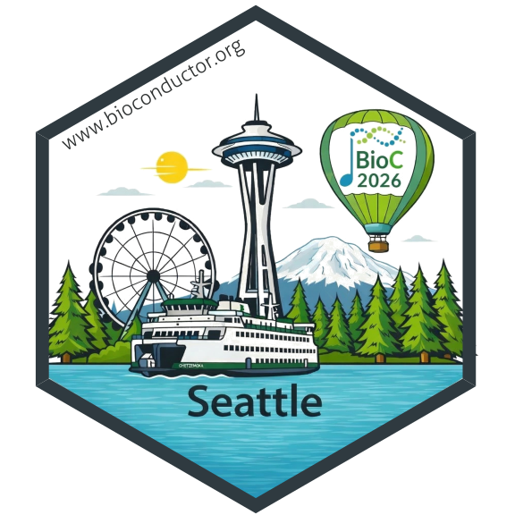

# The sticker for BioC 2026

* This is the sticker for the Bioconductor North American conference
  [**BioC2026**](https://bioc2026.bioconductor.org/).
* Sticker designer: Kavya Vaddadi
* This design celebrates Seattle as the host city of BioC 2026, featuring well-known landmarks such as the Space Needle, Great Wheel, Mount Rainier, and evergreen forests. The BioC 2026 hot air balloon is inspired by the scenic balloon views in the region and represents the celebratory spirit of the BioC community. Puget Sound and the Washington State ferry reflect Seattle’s maritime history and its spirit of exploration and teamwork. Together, these elements represent the welcoming and collaborative spirit of BioC 2026 in Seattle.
* License for the sticker and all drawings and pictures in this folder: Creative
  Commons Attribution
  [CC-BY](https://creativecommons.org/licenses/by/2.0/). Feel free to share and
  adapt, but don't forget to credit the author.

