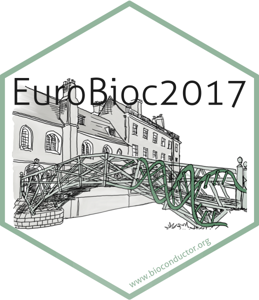

# The sticker for the European Bioconductor Meeting 2017

* Conference webpage: https://Bioconductor.github.io/EuroBioc2017/
* Where: University of Cambridge, UK.
* When: 4-6 December 2017.
* The sticker shows the Mathematical Bridge in Cambridge
  (https://en.wikipedia.org/wiki/Mathematical_Bridge).
* Sticker designer: Johannes Rainer (@jotsetung).
* Contributions and Suggestions: Laurent Gatto (@lgatto), Sebastian Gibb
  (@sgibb).
* License for the sticker and all drawings and pictures in this folder: Creative
  Commons Attribution
  [CC-BY](https://creativecommons.org/licenses/by/2.0/). Feel free to share and
  adapt, but don't forget to credit the author.

