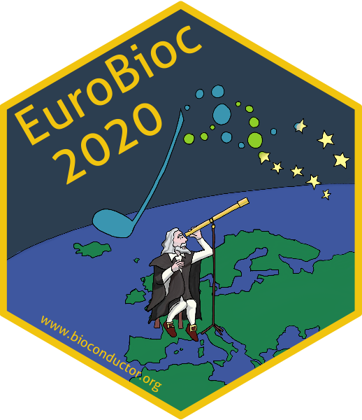

# The sticker for EuroBioc 2020

* This is the sticker for the European Bioconductor developer conference
  **EuroBioc2020**.
* Sticker designer: Johannes Rainer (@jorainer; twitter: @jo_rainer).
* Contributions and Suggestions: Davide Risso (@drisso).
* The sticker shows Galileo Galilei looking (from Padua) at the stars.
* License for the sticker and all drawings and pictures in this folder: Creative
  Commons Attribution
  [CC-BY](https://creativecommons.org/licenses/by/2.0/). Feel free to share and
  adapt, but don't forget to credit the author.

