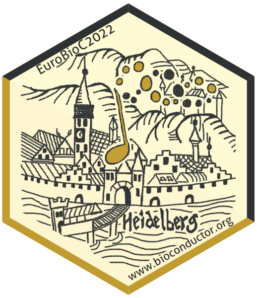
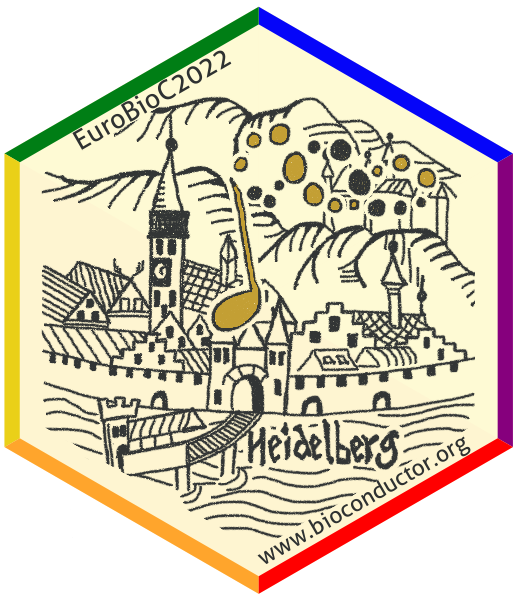
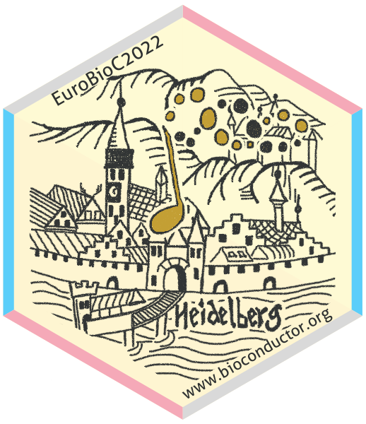

# The sticker for EuroBioC 2022

* This is the sticker for the European Bioconductor developer conference
  **EuroBioC2020**.
* Sticker designer: Johannes Rainer (@jorainer; twitter: @jo_rainer).
* Contributions and Suggestions: Laurent Gatto (@lgatto), Marcel Ramos
  (@LiNk-NY).
* The sticker is based on an [old
  drawing](https://en.wikipedia.org/wiki/Heidelberg_Castle#/media/File:Obere_Burg_und_Dicker_Turm_Heidelberger_Schloss_Sebastian_Muenster_Kalendarium_Hebraicum_1527_(Ausschnitt).jpg)
  of Heidelberg from the year 1527.
* License for the sticker and all drawings and pictures in this folder: Creative
  Commons Attribution
  [CC-BY](https://creativecommons.org/licenses/by/2.0/). Feel free to share and
  adapt, but don't forget to credit the author.

