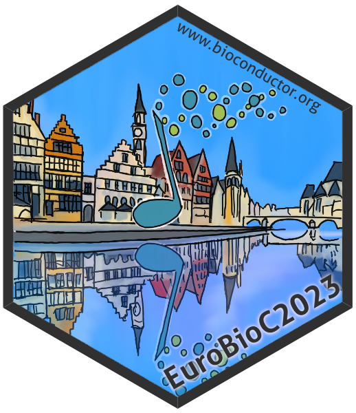
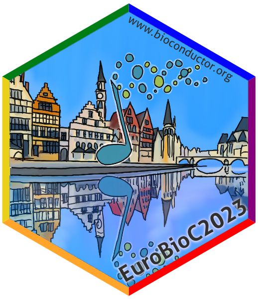
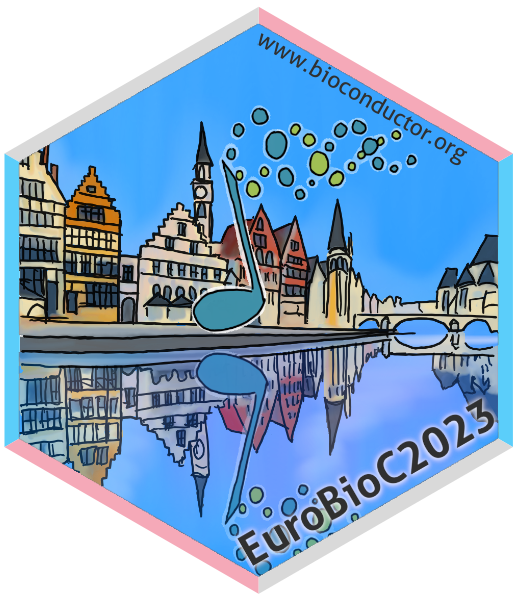

# The sticker for EuroBioC 2023

* This is the sticker for the European Bioconductor developer conference
  [**EuroBioC2023**](https://eurobioc2023.bioconductor.org/).
* Sticker designer: Johannes Rainer (@jorainer).
* Contributions and Suggestions: Lieven Clement (@lievenclement).
* The sticker features [Graslei](https://en.wikipedia.org/wiki/Graslei) in Ghent.
* License for the sticker and all drawings and pictures in this folder: Creative
  Commons Attribution
  [CC-BY](https://creativecommons.org/licenses/by/2.0/). Feel free to share and
  adapt, but don't forget to credit the author.

