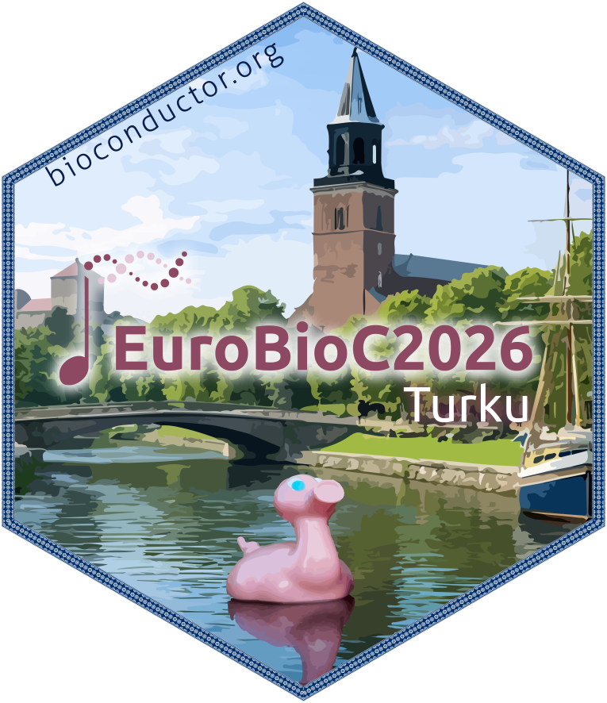

# The sticker for EuroBioC 2026

* This is the sticker for the European Bioconductor Conference 2026
  [**EuroBioC2026**](https://eurobioc2026.bioconductor.org/).
* Sticker designer: Rafael Romero Becerra
* This sticker captures EuroBioC2026 in Turku with the cathedral silhouette over
  the Aura River and Turku Castle in the background. At the river’s edge, a nod
  to the iconic Posankka—echoing the playful spirit of the Posankka race. The
  Finnish–Scandinavian folk-art border ties it together as a warm, regional
  welcome to the Bioconductor community.
* License for the sticker and all drawings and pictures in this folder: Creative
  Commons Attribution
  [CC-BY](https://creativecommons.org/licenses/by/2.0/). Feel free to share and
  adapt, but don't forget to credit the author.

