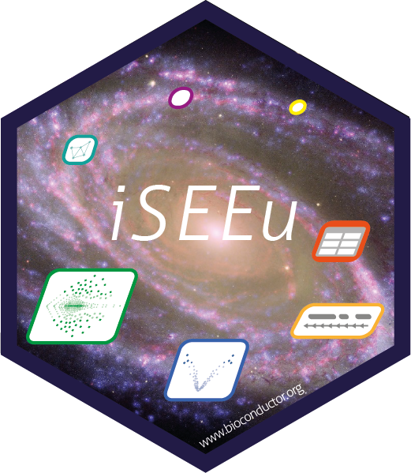

# The `iSEEu` package sticker

* Maintainer: [Kevin Rue-Albrecht](https://github.com/kevinrue/)
* License: Creative Commons Attribution
[CC-BY](https://creativecommons.org/licenses/by/2.0/). Feel free to
share and adapt, but don't forget to credit the author.

The original image of a spiral galaxy was obtained from the Internet using Google Images, see [this web page](https://theconversation.com/keplers-forgotten-ideas-about-symmetry-help-explain-spiral-galaxies-without-the-need-for-dark-matter-new-research-121017) for credits.

The panels use components adapted from the following BiocStickers:

- [limma](../limma)
- [Glimma](../Glimma)
- [GenomicRanges](../GenomicRanges)
- [RUVcorr](../RUVcorr)
