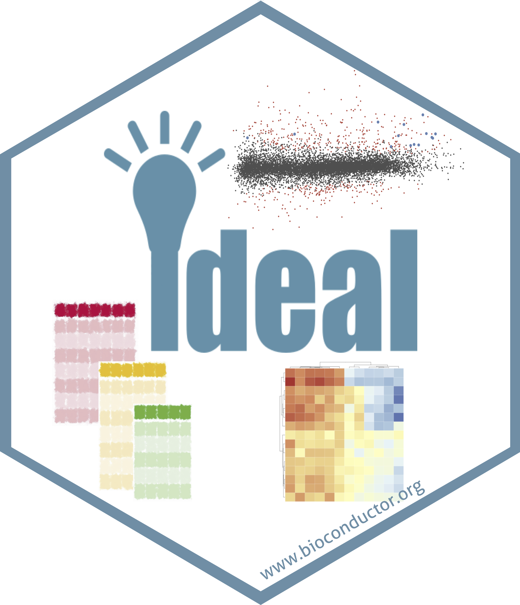

# ideal

This folder contains material and instructions for the making of the sticker for the `ideal` Bioconductor package.

## Credits

* subsequent steps have been performed with Microsoft PowerPoint and GIMP (https://www.gimp.org)

* the code for assembling the different components into the final sticker is based on the `hexSticker` package, by Guangchuang Yu
