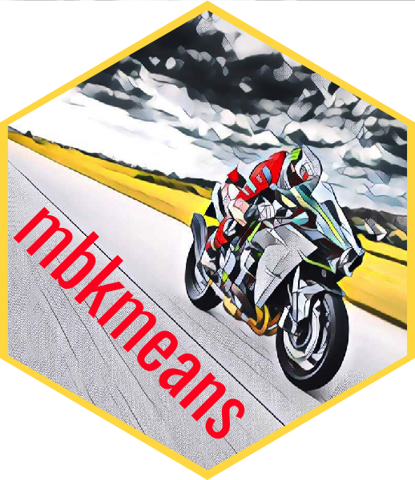

# The `mbkmeans` package sticker

* Sticker maintainer: [Davide Risso](https://github.com/drisso/)

The sticker was generated using
the [`mbkmeans.R`](./mbkmeans.R) `R` script that uses
the [`hexSticker`](https://github.com/GuangchuangYu/hexSticker) package. 

The bike image was modified starting from an image available at [unsplash.com](https://unsplash.com), see https://unsplash.com/license.
