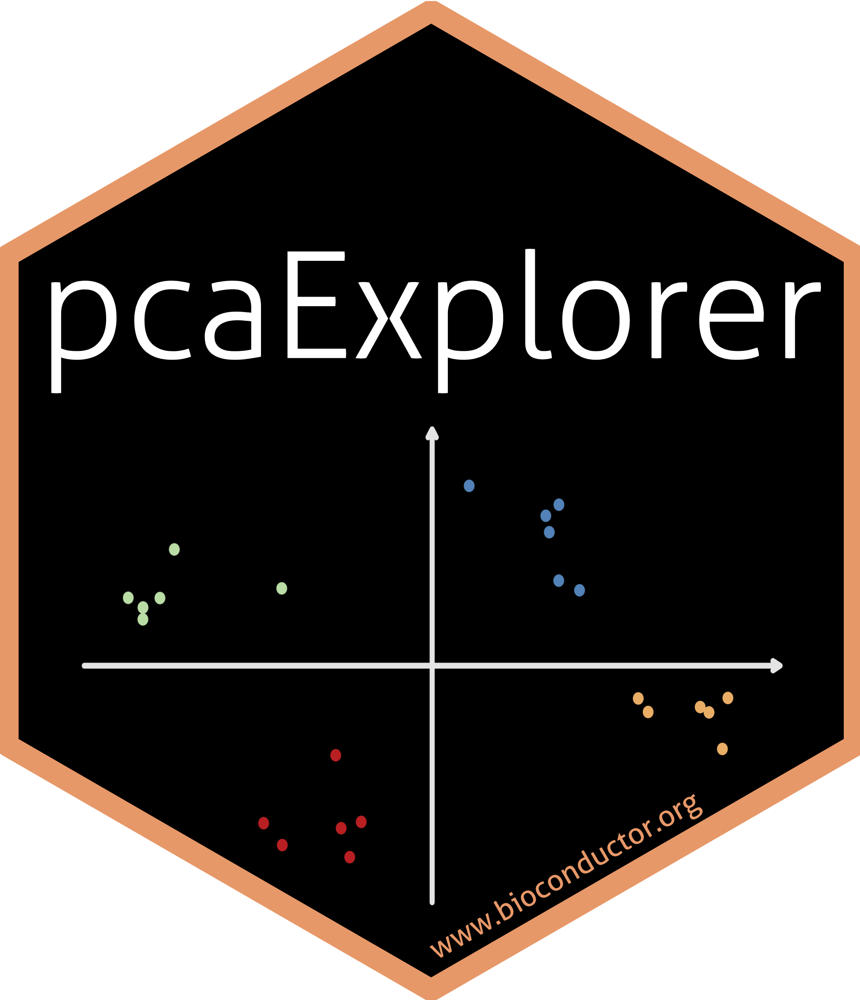

# pcaExplorer

This folder contains material and instructions for the making of the sticker for the `pcaExplorer` Bioconductor package.

## Credits

* no GIMPs were harmed during the making of this sticker

* the code for assembling the different components into the final sticker is based on the `hexSticker` package, by Guangchuang Yu
