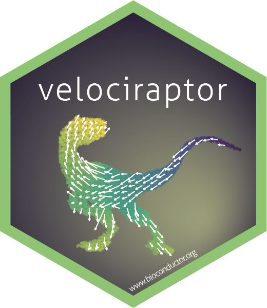

# The `velociraptor` package sticker

* Package URL: https://github.com/kevinrue/velociraptor
* Sticker maintainer: [Kevin Rue-ALbrecht](https://github.com/kevinrue/)
* License: Creative Commons Attribution
[CC-BY](https://creativecommons.org/licenses/by/2.0/). Feel free to
share and adapt, but don't forget to credit the author.

The sticker was generated using
the [`make.R`](./make.R) _R_ script that uses the following packages:

- [magick](https://CRAN.R-project.org/package=magick)
- [tidyverse](https://CRAN.R-project.org/package=tidyverse)
- [magrittr](https://CRAN.R-project.org/package=magrittr)
- [iSEE](https://bioconductor.org/packages/iSEE/)
- [ggplot2](https://CRAN.R-project.org/package=ggplot2)
- [SingleCellExperiment](https://bioconductor.org/packages/SingleCellExperiment)
- [slingshot](https://bioconductor.org/packages/slingshot)

The original velociraptor image was obtained from the Internet using Google Images, see <https://jurassicpark.fandom.com/wiki/Velociraptor> for credits.
